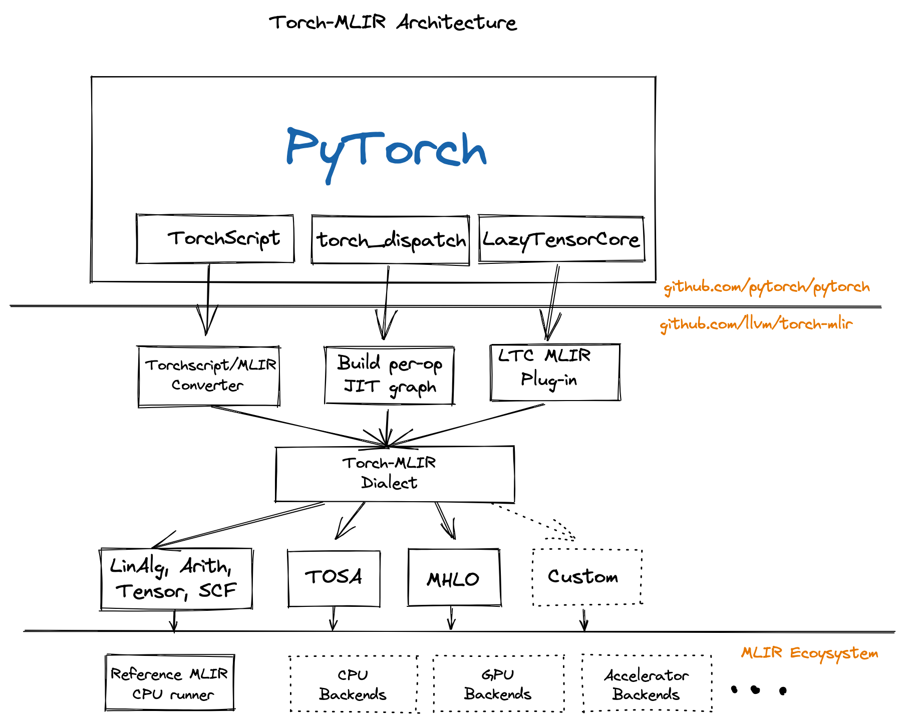

# torch-mlir

The Torch-MLIR project aims to provide first class compiler support from the [PyTorch](https://pytorch.org) ecosystem to the MLIR ecosystem.

> This project is participating in the LLVM Incubator process: as such, it is
not part of any official LLVM release.  While incubation status is not
necessarily a reflection of the completeness or stability of the code, it
does indicate that the project is not yet endorsed as a component of LLVM.

[PyTorch](https://pytorch.org)
An open source machine learning framework that accelerates the path from research prototyping to production deployment.

[MLIR](https://mlir.llvm.org)
The MLIR project is a novel approach to building reusable and extensible compiler infrastructure. MLIR aims to address software fragmentation, improve compilation for heterogeneous hardware, significantly reduce the cost of building domain specific compilers, and aid in connecting existing compilers together.

[Torch-MLIR](https://github.com/llvm/torch-mlir)
Multiple Vendors use MLIR as the middle layer mapping from platform frameworks like PyTorch, JAX, TensorFlow onto MLIR and then progressively lower down to their target hardware. We have seen half a dozen custom lowerings from PyTorch to MLIR. Having canonical lowerings from the PyTorch ecosystem to the MLIR ecosystem would provide much needed relief to hardware vendors to focus on their unique value rather than implementing another PyTorch frontend for MLIR. It would be similar to current hardware vendors adding LLVM target support instead of each one also implementing the Clang/C++ frontend.

## All the roads from PyTorch to Torch MLIR Dialect

We have few paths to lower down to the Torch MLIR Dialect.



 - Torchscript
    This is the most tested path down to Torch MLIR Dialect.
 - TorchFX
	This provides a path to lower from TorchFX down to MLIR. This a functional prototype that we expect to mature as TorchFX matures
 - Lazy Tensor Core (Based on lazy-tensor-core [staging branch](https://github.com/pytorch/pytorch/tree/lazy_tensor_staging/lazy_tensor_core))
	This path provides the upcoming LTC path of capture. It is based of an unstable devel branch but is the closest way for you to adapt any existing torch_xla derivatives.
 - “ACAP”  - Deprecated torch_xla based capture Mentioned here for completeness.

## Check out the code

```shell
git clone https://github.com/llvm/torch-mlir
cd torch-mlir
git submodule update --init
```

## Setup your Python Environment

```
python -m venv mlir_venv
source mlir_venv/bin/activate
python -m pip install --upgrade pip #Some older pip installs may not be able to handle the recent PyTorch deps
# Install latest PyTorch nightlies
python -m pip install --pre torch torchvision pybind11 -f https://download.pytorch.org/whl/nightly/cpu/torch_nightly.html
```

## Build 
```
cmake -GNinja -Bbuild \
  -DCMAKE_C_COMPILER=clang \
  -DCMAKE_CXX_COMPILER=clang++ \
  -DLLVM_ENABLE_PROJECTS=mlir \
  -DLLVM_EXTERNAL_PROJECTS=torch-mlir \
  -DLLVM_EXTERNAL_TORCH_MLIR_SOURCE_DIR=`pwd` \
  -DMLIR_ENABLE_BINDINGS_PYTHON=ON \
  -DLLVM_TARGETS_TO_BUILD=host \
  external/llvm-project/llvm

# Additional quality of life CMake flags:
# Enable ccache:
#   -DCMAKE_C_COMPILER_LAUNCHER=ccache -DCMAKE_CXX_COMPILER_LAUNCHER=ccache
# Enale LLD (links in seconds compared to minutes)
# -DCMAKE_EXE_LINKER_FLAGS_INIT="-fuse-ld=lld" -DCMAKE_MODULE_LINKER_FLAGS_INIT="-fuse-ld=lld" -DCMAKE_SHARED_LINKER_FLAGS_INIT="-fuse-ld=lld"
# Use --ld-path= instead of -fuse-ld=lld for clang > 13

cmake --build build
```
## Demos

## Setup ENV
```
export PYTHONPATH=`pwd`/build/tools/torch-mlir/python_packages/torch_mlir
```

### TorchScript

Running execution (end-to-end) tests:

```
# Run E2E TorchScript tests. These compile and run the TorchScript program
# through torch-mlir with a simplified MLIR CPU backend we call RefBackend
python -m e2e_testing.torchscript.main --filter Conv2d --verbose
```

[Example IR](https://gist.github.com/silvasean/e74780f8a8a449339aac05c51e8b0caa) for a simple 1 layer MLP to show the compilation steps from TorchScript.

Standalone script to Convert a PyTorch ResNet18 model to MLIR and run it on the CPU Backend:

```
# Run ResNet18 as a standalone script.
python examples/torchscript_resnet18_e2e.py

(mlir_venv) mlir@torch-mlir:~$ python examples/torchscript_resnet18_e2e.py
load image from https://upload.wikimedia.org/wikipedia/commons/2/26/YellowLabradorLooking_new.jpg
Downloading: "https://download.pytorch.org/models/resnet18-f37072fd.pth" to /home/anush/.cache/torch/hub/checkpoints/resnet18-f37072fd.pth
100.0%
PyTorch prediction
[('Labrador retriever', 70.66319274902344), ('golden retriever', 4.956596374511719), ('Chesapeake Bay retriever', 4.195662975311279)]
torch-mlir prediction
[('Labrador retriever', 70.66320037841797), ('golden retriever', 4.956601619720459), ('Chesapeake Bay retriever', 4.195651531219482)]

```

Jupyter notebook:
```
python -m ipykernel install --user --name=torch-mlir --env PYTHONPATH "$PYTHONPATH"
# Open in jupyter, and then navigate to
# `examples/resnet_inference.ipynb` and use the `torch-mlir` kernel to run.
jupyter notebook
```

### TorchFX

The `examples` folder includes the Python package `torchfx`, which is a functional prototype of a TorchFX to MLIR pipeline. The main entry point into the `torchfx` package is the `torchfx.builder` module, which includes a function for converting the output of a TorchFX trace into MLIR. Currently, the number of PyTorch operations supported is very limited, but will be expanded in the future.

#### Example usage of `torchfx`

The `examples` folder includes scripts `torchfx_*.py` showing how to use the TorchFX to MLIR pipeline. In order to run the examples, make sure you've setup your `PYTHONPATH` by following [these](#setup-env) instructions, and add `/path/to/torch-mlir/examples` to your `PYTHONPATH`.

Then, run

```
python torchfx_example_name.py
```

replacing `torchfx_example_name.py` with the actual `torchfx` example you want to run.


### Lazy Tensor Core

The `examples` folder includes the Python package `lazytensor`, which implements a Lazy Tensor Core (LTC) to MLIR pipeline. The main entry point into the `lazytensor` package is the `lazytensor.builder`, which includes the function `build_module` that takes a computation captured and converted to TorchScript IR by LTC, and converts it to MLIR.

#### Example usage of `lazytensor`

The `examples` folder includes scripts `lazytensor_*.py` showing how to use the Lazy Tensor to MLIR pipeline. The examples depend on the Lazy Tensor Core (LTC) of PyTorch. For information on how to obtain LTC, see [here](https://github.com/pytorch/pytorch/blob/lazy_tensor_staging/lazy_tensor_core/QUICKSTART.md). 

In order to run the examples, make sure you've setup your `PYTHONPATH` by following [these](#setup-env) instructions, and also add the following to your `PYTHONPATH`:
1. `/path/to/torch-mlir/examples`
2. `/path/to/pytorch/lazy_tensor_core`

Then, run

```
python lazytensor_example_name.py
```

replacing `lazytensor_example_name.py` with the actual `lazytensor` example you want to run.

## Repository Layout

The project follows the conventions of typical MLIR-based projects:

* `include/torch-mlir`, `lib` structure for C++ MLIR compiler dialects/passes.
* `test` for holding test code.
* `tools` for `torch-mlir-opt` and such.
* `python` top level directory for Python code

## Interactive Use

The `build_tools/write_env_file.sh` script will output a `.env`
file in the workspace folder with the correct PYTHONPATH set. This allows
tools like VSCode to work by default for debugging. This file can also be
manually `source`'d in a shell.

## Project Communication

- `#torch-mlir` channel on the LLVM [Discord](https://discord.gg/xS7Z362)
- Issues [here](https://github.com/llvm/torch-mlir/issues)
- [`torch-mlir` section](https://llvm.discourse.group/c/projects-that-want-to-become-official-llvm-projects/torch-mlir/41) of LLVM Discourse
