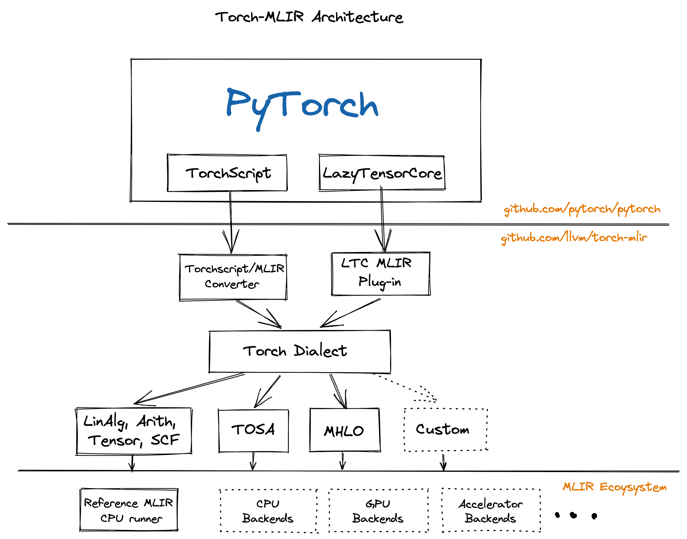

# The Torch-MLIR Project 

The Torch-MLIR project aims to provide first class compiler support from the [PyTorch](https://pytorch.org) ecosystem to the MLIR ecosystem.

> This project is participating in the LLVM Incubator process: as such, it is
not part of any official LLVM release.  While incubation status is not
necessarily a reflection of the completeness or stability of the code, it
does indicate that the project is not yet endorsed as a component of LLVM.

[PyTorch](https://pytorch.org)
PyTorch is an open source machine learning framework that facilitates the seamless transition from research and prototyping to production-level deployment. 

[MLIR](https://mlir.llvm.org)
The MLIR project offers a novel approach for building extensible and reusable compiler architectures, which address the issue of software fragmentation, reduce the cost of developing domain-specific compilers, improve compilation for heterogeneous hardware, and promote compatibility between existing compilers.

[Torch-MLIR](https://github.com/llvm/torch-mlir)
Several vendors have adopted MLIR as the middle layer in their systems, enabling them to map frameworks such as PyTorch, JAX, and TensorFlow into MLIR and subsequently lower them to their target hardware. We have observed half a dozen custom lowerings from PyTorch to MLIR, making it easier for hardware vendors to focus on their unique value, rather than needing to implement yet another PyTorch frontend for MLIR. The ultimate aim is to be similar to the current hardware vendors adding LLVM target support, rather than each one implementing Clang or a C++ frontend.

[](https://github.com/llvm/torch-mlir/actions/workflows/buildRelease.yml)

## All the roads from PyTorch to Torch MLIR Dialect

We have few paths to lower down to the Torch MLIR Dialect.



 - TorchScript
    This is the most tested path down to Torch MLIR Dialect.
 - LazyTensorCore
    Read more details [here](docs/ltc_backend.md).
 - We also have basic TorchDynamo/PyTorch 2.0 support, see our
   [long-term roadmap](docs/long_term_roadmap.md) and
   [Thoughts on PyTorch 2.0](https://discourse.llvm.org/t/thoughts-on-pytorch-2-0/67000/3)
   for more details.

## Project Communication

- `#torch-mlir` channel on the LLVM [Discord](https://discord.gg/xS7Z362) - this is the most active communication channel
- Github issues [here](https://github.com/llvm/torch-mlir/issues)
- [`torch-mlir` section](https://llvm.discourse.group/c/projects-that-want-to-become-official-llvm-projects/torch-mlir/41) of LLVM Discourse

### Meetings

Community Meeting / Developer Hour:
- 1st and 3rd Monday of the month at 9 am PST
- 2nd and 4th Monday of the month at 5 pm PST

Office Hours:
- Every Thursday at 8:30 am PST

Meeting links can be found [here](https://discourse.llvm.org/t/new-community-meeting-developer-hour-schedule/73868).

## Install torch-mlir snapshot

At the time of writing, we release pre-built snapshots of torch-mlir for Python 3.11.

If you have Python 3.11, the following commands initialize a virtual environment.
```shell
python3.11 -m venv mlir_venv
source mlir_venv/bin/activate
```

Or, if you want to switch over multiple versions of Python using conda, you can create a conda environment with Python 3.11.
```shell
conda create -n torch-mlir python=3.11
conda activate torch-mlir
python -m pip install --upgrade pip
```

Then, we can install torch-mlir with the corresponding torch and torchvision nightlies.
```
pip install --pre torch-mlir torchvision \
  -f https://llvm.github.io/torch-mlir/package-index/ \
  --extra-index-url https://download.pytorch.org/whl/nightly/cpu
```

## Demos

### TorchScript ResNet18 

Standalone script to Convert a PyTorch ResNet18 model to MLIR and run it on the CPU Backend:

```shell
# Get the latest example if you haven't checked out the code
wget https://raw.githubusercontent.com/llvm/torch-mlir/main/projects/pt1/examples/torchscript_resnet18.py

# Run ResNet18 as a standalone script.
python projects/pt1/examples/torchscript_resnet18.py

load image from https://upload.wikimedia.org/wikipedia/commons/2/26/YellowLabradorLooking_new.jpg
Downloading: "https://download.pytorch.org/models/resnet18-f37072fd.pth" to /home/mlir/.cache/torch/hub/checkpoints/resnet18-f37072fd.pth
100.0%
PyTorch prediction
[('Labrador retriever', 70.66319274902344), ('golden retriever', 4.956596374511719), ('Chesapeake Bay retriever', 4.195662975311279)]
torch-mlir prediction
[('Labrador retriever', 70.66320037841797), ('golden retriever', 4.956601619720459), ('Chesapeake Bay retriever', 4.195651531219482)]
```

### Lazy Tensor Core

View examples [here](docs/ltc_examples.md).

## Repository Layout

The project follows the conventions of typical MLIR-based projects:

* `include/torch-mlir`, `lib` structure for C++ MLIR compiler dialects/passes.
* `test` for holding test code.
* `tools` for `torch-mlir-opt` and such.
* `python` top level directory for Python code

## Developers
If you would like to develop and build torch-mlir from source please look at [Development Notes](docs/development.md)
