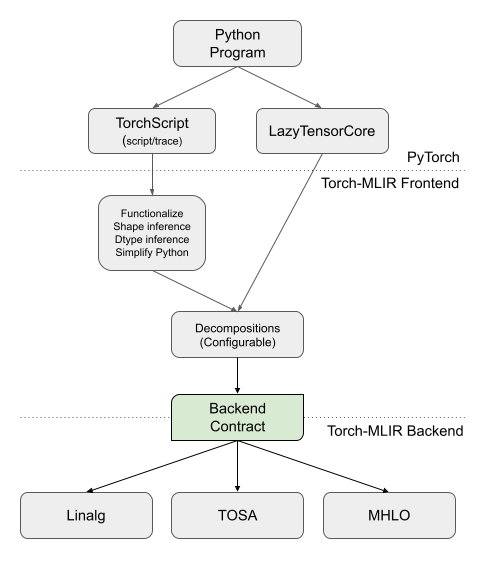

# Torch-MLIR Architecture

## Introduction

The Torch-MLIR project provides core infrastructure for bridging the PyTorch
ecosystem and the MLIR ecosystem. For example, Torch-MLIR enables PyTorch models
to be lowered to a few different MLIR dialects. Torch-MLIR does not attempt to
provide a production end-to-end flow for PyTorch programs by itself, but is a
useful component for constructing one.

## Overview

Torch-MLIR has two parts, which we call the "frontend" and "backend". These two
halves interface at an abstraction layer that we call the "backend contract",
which is a subset of the `torch` dialect with certain properties appealing for
backends to lower from.



The frontend of Torch-MLIR is concerned with interfacing to PyTorch itself, and
then normalizing the program to the "backend contract". This part involves build
system complexity and exposure to PyTorch APIs to get the program into the MLIR
`torch` dialect. When we interface with TorchScript, we additionally have a
large amount of lowering and simplification to do within MLIR on the `torch`
dialect.

The "backend" of Torch-MLIR takes IR in the "backend contract" form and lowers
it to various target dialects of interest to the MLIR ecosystem (various
"backends"). In particular, right now we support lowering to:

- Linalg-on-Tensors (+ `arith`, `tensor`, etc.)
- [TOSA](https://mlir.llvm.org/docs/Dialects/TOSA/)
- [StableHLO](https://github.com/openxla/stablehlo)

The terms "frontend" and "backend" are highly overloaded in any compiler
project, but frequently in Torch-MLIR this is the meaning that they have.
Sometimes "frontend" can mean something even further up the stack, such as
something in PyTorch itself. When there is ambiguity we will refer to this as
"at the PyTorch level". Similarly, "backend" can sometimes refer to something
sitting below Linalg-on-Tensors, TOSA, or StableHLO.

## The `torch` dialect

See [include/torch-mlir/Dialect/Torch/IR](https://github.com/llvm/torch-mlir/tree/main/include/torch-mlir/Dialect/Torch/IR)

The central MLIR abstraction in the Torch-MLIR project is the `torch` dialect.
This dialect supports progressive lowering from the raw imported PyTorch
programs that various PyTorch integration points provide, all the way down to
the backend contract.

The `torch` dialect must be versatile enough to support being imported by any
program capture mechanism in PyTorch -- this could be TorchDynamo, `torch.fx`,
LazyTensorCore, TorchScript, `torch.jit.trace`, etc. Thankfully, PyTorch is
factored such that we can handle this with one core import path, which is
through the PyTorch
"[JIT IR](https://github.com/pytorch/pytorch/blob/78c8a0d75220bdd4955415b5f81509e005af4232/torch/csrc/jit/OVERVIEW.md)",
and lives in
[torch-mlir/python/torch_mlir/jit_ir_importer](https://github.com/llvm/torch-mlir/tree/e322f6a8784009b37aa354abfa9a40a80f30877d/python/torch_mlir/dialects/torch/importer/jit_ir).
The JIT IR is a highly principled IR that faithfully models a Python subset (+
tensors, the PyTorch op registry, and a few other things). All the other PyTorch
program representations can eventually bottom-out on the JIT IR via some path
provided by PyTorch. The `torch` dialect is almost entirely in 1:1
correspondence with the JIT IR -- this allows the importer to be extremely small
(the core is
[under 500 lines of code](https://github.com/llvm/torch-mlir/blob/e322f6a8784009b37aa354abfa9a40a80f30877d/python/torch_mlir/jit_ir_importer/csrc/node_importer.cpp#L1)).

### Ops

See [TorchOps.td](https://github.com/llvm/torch-mlir/blob/114f48e96c578ee76a6f83b3aa4aa229a8d5b76e/include/torch-mlir/Dialect/Torch/IR/TorchOps.td#L1)

The ops in the `torch` dialect are almost entirely generated based on the
PyTorch JIT IR operator registry via the script
[torch_ods_gen.py](https://github.com/llvm/torch-mlir/blob/e322f6a8784009b37aa354abfa9a40a80f30877d/python/torch_mlir/jit_ir_importer/build_tools/torch_ods_gen.py#L1) (invoked via [update_torch_ods.sh](https://github.com/llvm/torch-mlir/blob/main/build_tools/update_torch_ods.sh)).
This script queries the registry and generates MLIR
[ODS](https://mlir.llvm.org/docs/OpDefinitions/) in
[GeneratedTorchOps.td](https://github.com/llvm/torch-mlir/blob/e322f6a8784009b37aa354abfa9a40a80f30877d/include/torch-mlir/Dialect/Torch/IR/GeneratedTorchOps.td#L1). We have a guide for [adding a new op end-to-end](https://github.com/llvm/torch-mlir/wiki/Torch-ops-E2E-implementation).

There are also some manually implemented ops in the following categories (see
[TorchOps.td](https://github.com/llvm/torch-mlir/blob/e322f6a8784009b37aa354abfa9a40a80f30877d/include/torch-mlir/Dialect/Torch/IR/TorchOps.td#L1)):

- Ops used for modeling PyTorch IValue object graphs (e.g. `torch.nn_module`,
  `torch.class_type`).
- `torch.global_slot` and related ops which are used to model an incremental
  lowering of the IValue object graphs.
- Ops that are supported in the JIT interpreter directly, and so don't have a
  corresponding op in the registry (e.g. `torch.prim.If`,
  `torch.prim.ListConstruct`, `torch.constant.*`)
- `torch.operator` which is used to represent ops from the registry which
  haven't been generated by `torch_ods_gen.py`.

### Types

See [TorchTypes.td](https://github.com/llvm/torch-mlir/blob/e322f6a8784009b37aa354abfa9a40a80f30877d/include/torch-mlir/Dialect/Torch/IR/TorchTypes.td#L1)

The `torch` dialect has a complete set of types modeling the PyTorch type
system, which itself is a strongly typed subset of the Python type system (+
tensors). These types are almost all 1:1 with the corresponding
[PyTorch types](https://github.com/pytorch/pytorch/blob/c54d18dbc7bb2f9fdd83c5de529702e5a02295c3/aten/src/ATen/core/jit_type.h#L1).

The one exception where a significant amount of design work has been done in
Torch-MLIR is the handling of tensors. Torch-MLIR's tensor types allow
progressive lowering from raw imported IR which maybe be missing shapes, dtypes,
and value semantics, into the backend contract which provides those. Torch-MLIR
has two tensor types `ValueTensorType` (`!torch.vtensor`) and
`NonValueTensorType` (`!torch.tensor`) sharing most of their definition in
[TorchTypes.td](https://github.com/llvm/torch-mlir/blob/e322f6a8784009b37aa354abfa9a40a80f30877d/include/torch-mlir/Dialect/Torch/IR/TorchTypes.td#L58).
The `NonValueTensorType` models a `torch.Tensor` including mutation, aliasing,
etc. while the `ValueTensorType` has value semantics. That is, `ValueTensorType`
is immutable and non-aliased. These types have a common C++ base class
[`BaseTensorType`](https://github.com/llvm/torch-mlir/blob/e322f6a8784009b37aa354abfa9a40a80f30877d/include/torch-mlir/Dialect/Torch/IR/TorchTypes.h#L40)
which permits abstracting across them. Both `ValueTensorType` and
`NonValueTensorType` have an optional list of optional sizes and an optional
dtype.

## The "backend contract"

See [satisfiesBackendContract](https://github.com/llvm/torch-mlir/blob/114f48e96c578ee76a6f83b3aa4aa229a8d5b76e/lib/Dialect/Torch/Transforms/LowerToBackendContract.cpp#L151)

The backend contract is a normalized form of the `torch` dialect with a set of
properties that make it easy to lower into various forms such as
Linalg-on-Tensors, TOSA, StableHLO, or other forms that we don't provide out of
the box. The primary guarantees that we provide Torch-MLIR's backends are:

- All tensors have been converted to value semantics.
- All tensors have at least a known number of dimensions (i.e. rank), and
  ideally also have a precise size for each dimension.
- All tensors have a known dtype.
- Certain ops have been decomposed to make them easier to handle (this is
  configurable).

See the extensive comments in the function `satisfiesBackendContract` (and its
callees) in the `LowerToBackendContract` pass for an extended rationale for
these decisions, and a precise definition of the backend contract.

## The Frontends

Torch-MLIR provides 2 main frontends:

- LazyTensorCore - a frontend that is based around intercepting PyTorch
  dispatcher calls and creating a graph that is lazily evaluated on demand.
- TorchScript - a frontend based around importing TorchScript functions or
  modules. Such modules or functions can be obtained via `torch.jit.script`,
  `torch.jit.trace`, or a few other methods in the PyTorch ecosystem.

Internally these share a lot of the core import code.

### LazyTensorCore

Docs: https://github.com/llvm/torch-mlir/blob/main/docs/ltc_backend.md

LazyTensorCore (LTC) is a program capture method provided by PyTorch that does
device-level tracing. This low-level interception point sits below gradient
calculations, and is thus a good choice for training flows. The downside of LTC
is that it depends on having the whole PyTorch runtime available, so cannot be
used for ahead-of-time compilation or capturing standalone program artifacts.

From an implementation perspective, the JIT IR that is produced by
LazyTensorCore has already had a number of transformations performed on it, in
particular, after importing from JIT IR to MLIR, the backend contract is
trivially satisfied. So the Torch-MLIR implementation complexity for
LazyTensorCore is restricted to build system and PyTorch integration, rather
than actual MLIR compiler passes.

### TorchScript (`torch.jit.script`)

[TorchScript](https://pytorch.org/docs/stable/jit.html) is a strict Python
subset which is modeled faithfully in the JIT IR. Additionally, TorchScript can
represent a full `torch.nn.Module` object graph (hierarchy). This results in a
significant amount of work needing to be done by the frontend to lower it to the
backend contract:

- The `torch.nn.Module` hierarchy must be lowered to the backend contract, which
  does not allow any program state.
- The program must be converted to value semantics (functionalized).
- Shapes and dtypes must be inferred.
- Many "Python-isms" must be simplified away, such as list appends, string
  operations, etc.

Because TorchScript does not naturally give shapes or dtypes, we usually require
the user to annotate a set of expected shapes and dtypes of any arguments. We then propagate those throughout the program.

`torch.jit.trace` produces JIT IR with shapes and dtypes already, but no value
semantics. And often users want to erase the shapes in the trace to allow
dynamic shapes for the trace. Additionally, the Python-level data structures and
APIs are very parallel between `torch.jit.script` and `torch.jit.trace`, so we
consider both of those as the same from the perspective of the responsibilities
of the compiler. Both are accessed via the `torch_mlir.torchscript.compile` Python API.

### Modeling the `torch.nn.Module` object (`IValue`) hierarchy for TorchScript

PyTorch consistently models a subset of Python objects with its concept of
[`IValue`](https://github.com/pytorch/pytorch/blob/1ee9eb52b612f5fb4b63bbda832e44c8902edb64/aten/src/ATen/core/ivalue.h#L171)
(interpreter value). These are used throughout PyTorch to represent Python
values. When one `torch.jit.script`'s a `torch.nn.Module`, the result is
actually an `IValue` that represents the module, with a hierarchy of children
`IValue`'s. Strictly speaking, JIT IR `torch::jit::Graph`'s are only used to
represent the bodies of methods on the modules. So in addition to importing the
JIT IR, we also need to import the `IValue`'s. This happens inside [ivalue_importer.cpp](https://github.com/llvm/torch-mlir/blob/fde390c7669e29362b18388448ef2b188713383f/python/torch_mlir/jit_ir_importer/csrc/ivalue_importer.cpp#L1).

Most of the IValue modeling can reuse `torch` dialect ops that already exist
otherwise, such as `torch.constant.int` to represent an int in the object graph.
However, special IR constructs are needed for modeling the `torch.nn.Module`'s
themselves.

An example is:

```mlir
torch.class_type @c {
  torch.attr "b" : !torch.bool
  torch.attr "i" : !torch.int
  torch.attr "f" : !torch.float
  torch.attr "t" : !torch.tensor
  torch.method "get_tensor", @get_tensor
}
func.func private @get_tensor(%arg0: !torch.nn.Module<"c">) -> !torch.tensor {
  %2 = torch.prim.GetAttr %arg0["t"] : !torch.nn.Module<"c"> -> !torch.tensor
  return %2 : !torch.tensor
}

%true = torch.constant.bool true
%int3 = torch.constant.int 3
%float4.250000e01 = torch.constant.float 4.250000e+01
%0 = torch.tensor.literal(dense<1.000000e+00> : tensor<1xf32>) : !torch.tensor
%1 = torch.nn_module {
  torch.slot "b", %true : !torch.bool
  torch.slot "i", %int3 : !torch.int
  torch.slot "f", %float4.250000e01 : !torch.float
  torch.slot "t", %0 : !torch.tensor
} : !torch.nn.Module<"c">
```

See the documentation for the ops for more information on the semantics of this
form.


### Lowering TorchScript to the backend contract

The `torchscript-module-to-torch-backend-pipeline` contains the set of simplifications used convert TorchScript to the backend contract. At a high level, it consists of the following transformations:

1. GlobalizeObjectGraph: This takes the `IValue` object graph and converts it
   into a flat list of globals (see `torch.global_slot` and related ops).
1. LowerToBackendContract: This pass iteratively applies a simplification
   pipeline until the backend contract is reached. The simplification pipeline consists of:
   - Standard canonicalization.
   - Shape and Dtype refinement. See [abstract_interp_lib.md](https://github.com/llvm/torch-mlir/blob/main/docs/abstract_interp_lib.md) for detail
   - Decomposing ops into more primitive ops. See `DecomposeComplexOps`.

### Layering of the PyTorch Dependency

One of the core principles of our Torch-MLIR <-> PyTorch interop is that
anything that links against PyTorch must interact with MLIR through
[the Torch-MLIR C API](https://github.com/llvm/torch-mlir/tree/main/include/torch-mlir-c).
This bypasses a number of very complex dependency and shared library issues.

Additionally, we maintain the invariant that the core MLIR compiler code (in
`lib/` and `include/`) never has a build dependency on PyTorch itself. This
strict isolation avoids a number of complex dependency issues and ensures that
`torch-mlir-opt` and similar debugging tools always provide the excellent
development and debugging experience that MLIR developers expect. Sometimes,
certain highly stable enums and related logic must be shared with upstream
PyTorch, and for those we copy code from PyTorch into
[TorchUpstream.h](https://github.com/llvm/torch-mlir/blob/fde390c7669e29362b18388448ef2b188713383f/include/torch-mlir/Dialect/Torch/Utils/TorchUpstream.h#L13).

## The Backends

Torch-MLIR provides 3 built-in backends, which take the backend contract IR and
lower it to the requirements of each backend. The 3 backends are:

- [`linalg`](https://mlir.llvm.org/docs/Dialects/Linalg/) on tensors (+ `arith`,
  `tensor`, etc.)
- [TOSA](https://mlir.llvm.org/docs/Dialects/TOSA/)
- [StableHLO](https://github.com/openxla/stablehlo)

### The Linalg Backend (Linalg-on-Tensors)

Code: https://github.com/llvm/torch-mlir/tree/main/lib/Conversion/TorchToLinalg

The Linalg-on-Tensors backend was the first backend that we added, and it is
still the most complete. It fully supports dynamic shapes (known number of
dimensions but arbitrary dynamic dimension sizes). Since linalg was originally
designed as a dialect for transformations, it can be too low-level for certain
consumers.

### The TOSA Backend

Code: https://github.com/llvm/torch-mlir/tree/main/lib/Conversion/TorchToTosa

The TOSA backend was the second backend that we added. It remains preferred by
many users (especially "hardware" or "hardware-adjacent" folks). Some of its characteristics are:
- It is tied to a [spec](https://www.mlplatform.org/tosa/tosa_spec.html) with a
  really clear "ISA-like" expository style that resonates with a lot of folks
- The coarse-grained named-op approach is a good match for the many compilers
  that are designed that way.
- It has really good support for quantization / integer data types.
- It has clear versioning/stability guarantees on the op semantics.
- It is extremely solid with static shapes (and many of its users only care
  about static shapes, so that's fine).

### The StableHLO Backend

Code: https://github.com/llvm/torch-mlir/tree/main/lib/Conversion/TorchToStablehlo

The StableHLO backend was the third backend that we added, and it offers a
reasonable blend of the benefits of the other two.
- It is a coarse-grained named-op approach.
- It has a pretty clear spec for most of the ops (with a bit of mental
  translation and hoping that StableHLO is the same as HLO):
  https://www.tensorflow.org/xla/operation_semantics
- It functionally supports dynamic shapes (though not as coherent and consistent
  as Linalg-on-Tensors, and the dynamic shape support falls outside the
  wonderful HLO docs above).
- It appears to be pretty tied to HLO (which is highly mature) so most of the op
  surface area doesn't change too much.
- It has a different set of principles than TOSA which tend to make it more
  expressive at the cost of having a larger abstraction gap from hardware. For
  example, TOSA limits (for highly considered reasons) the number of dimensions
  that certain operators can handle to 1D-4D, when from a purely algebraic
  perspective there isn't a good reason to not be more general. Similarly, more
  general forms of reduction and scatter also fall into StableHLO nicely while
  TOSA's principles tend to bias it away from that.

### Backend Implementation

All the backends are implemented using the MLIR [Dialect Conversion
infrastructure](https://mlir.llvm.org/docs/DialectConversion/). This involves
converting the `torch` dialect types to other types, so we closely follow the
principles from the "Type Conversions the Not-So-Hard Way" talk
([slides](https://drive.google.com/file/d/1FVbzCXxZzS9LBLuvpPNLWJD-XDkt54ky/view?usp=sharing),
[recording](https://drive.google.com/file/d/1VfVajitgf8ZPnd-HRkJvaJiFLhBsluXN/view?usp=sharing)).
We follow the standard `{include,lib}/Conversion/TorchTo*` convention used in
MLIR for conversion passes.

For type conversion, we provide
[BackendTypeConversion.cpp](https://github.com/llvm/torch-mlir/blob/57681f794764a34c34e2be7f07f7dfbcafa683c1/lib/Dialect/TorchConversion/Transforms/BackendTypeConversion.cpp#L1)
and
[BackendTypeConversionPasses.cpp](https://github.com/llvm/torch-mlir/blob/57681f794764a34c34e2be7f07f7dfbcafa683c1/lib/Dialect/TorchConversion/Transforms/BackendTypeConversionPasses.cpp#L1)
which provide a default conversion from `torch` dialect types to the builtin
`tensor` type and scalar integer/float types. These are not the right choice for
all backends, but can be copied and adapted by backends. These files closely
follow the "Type Conversions the Not-So-Hard Way" talk.


## Testing

See
[development.md](https://github.com/llvm/torch-mlir/blob/9c8b96272057f4f8210de5842b6952228434cfa2/development.md#testing)
for more details on running tests.

Torch-MLIR has two types of tests:

1. End-to-end execution tests. These compile and run a program and check the
   result against the expected output from execution on native Torch. These use
   a homegrown testing framework (see
   [framework.py](https://github.com/llvm/torch-mlir/blob/7d4a0d0e2b65c7ce8de19993f3b10ad5344fe32b/python/torch_mlir_e2e_test/torchscript/framework.py#L6))
   and the test suite lives at `python/torch_mlir_e2e_test/test_suite`.

2. Compiler and Python API unit tests. These use LLVM's `lit` testing framework.
   For example, these might involve using `torch-mlir-opt` to run a pass and
   check the output with `FileCheck`. `lit` is flexible enough to unit test
   various Python pieces, importers, and LTC this way as well.

### Why so much end-to-end testing?

Torch-MLIR places a heavy emphasis on end-to-end testing for the following reasons:

Reason 1: Even if a compiler pass produces the output IR that the author
expected, that output IR may not correctly implement the semantics of the op.
This is especially true for complex, often-poorly-specified deep learning
operators that Torch-MLIR is mainly concerned with. It is critical to run these
against the source of truth to ensure correct implementation.

Reason 2: There are many patterns in Torch-MLIR's backends that really just
expand one op into other ops without any real logic. When we started Torch-MLIR,
we were very religious about always having `.mlir` unit tests even for these
"macro expansion" patterns, but we found that these tests 1) Never caught a bug
2) Interfered with refactoring / caused spurious extra work (changing op syntax,
etc.). There is not much point to having a bunch of tests like this, which are
basically just rewriting the builder calls in a different syntax:

```
// MyPass.cpp
b.create<FooOp>(...)
b.create<BarOp>(...)

// test.mlir
// CHECK: foo
// CHECK: bar
```

Such a test is simply checking that the implementation of an op is the way it
is. There is no way to change the implementation while having the test pass. So
the test is fully redundant with the implementation.

Because of this, many Torch-MLIR patches adding support for new ops have no
`.mlir` unit tests, and only include end-to-end test(s). We generally make sure
that our end-to-end tests are as targeted as possible. As a result, when
debugging end-to-end test failures, the resulting reproducers (which our test
framework automatically produces for failures) are usually already fully reduced
test cases.

### Do's and Don'ts for unit vs end-to-end testing.

DO use an [end-to-end test](adding_an_e2e_test.md) if you are implementing a
new op or extending the support for an existing op.

DO use a unit test if your lowering for an op has multiple cases / logic. This
also helps future maintainers of the lowering to see in one place all the
different edge cases of the op that you had to handle. (these can be easily
reduced out of all the end-to-end tests you added).

DON'T use a unit test if your lowering pattern could be described as a trivial
"macro expansion" of one op into another op or set of ops. That is, if you feel
like your unit test is just rewriting `b.create<...>(...)` into `CHECK: ...`
then it is probably not a useful unit test.

With the exceptions above, all changes should include appropriate unit tests, as
is standard in the LLVM and MLIR community. This includes full coverage of all
canonicalizations, pretty printing, passes, errors, and diagnostics.

### The RefBackend (Reference Backend)

In order to run end-to-end tests, Torch-MLIR needs an end-to-end flow.
Thankfully, upstream MLIR has just enough pieces to precariously put one
together that is enough for testing.

The RefBackend consists of a few minor
[C++ passes](https://github.com/llvm/torch-mlir/blob/114f48e96c578ee76a6f83b3aa4aa229a8d5b76e/include/torch-mlir/RefBackend/Passes.td#L1)
filling in some corners missing upstream and
[Python glue logic](https://github.com/llvm/torch-mlir/blob/114f48e96c578ee76a6f83b3aa4aa229a8d5b76e/python/torch_mlir_e2e_test/linalg_on_tensors_bakends/refbackend.py#L1)
to pull together upstream functionality into a working system.

The RefBackend accepts Linalg-on-Tensors as input. It mainly just bufferizes the
ops and lowers them to loops. Note that TOSA and StableHLO (via MHLO) support
lowering to Linalg-on-Tensors, so all our end-to-end testing bottoms out on
RefBackend.

The RefBackend is absolutely not suitable for any production use case. It leaks
memory, doesn't support any error handling, performs no optimizations, and
probably a bunch of other horrible things. We are patiently awaiting for the
upstream MLIR community to produce a viable end-to-end flow with better
characteristics.

### Presentations and Talks

* 2021-10-07: MLIR ODM: Introduction to Torch-MLIR. ([recording](https://www.youtube.com/watch?v=QbNkex-gizs) and [slides](https://docs.google.com/presentation/d/1ZhzfE4EK6XV7AdQTYicrsE_OYjkER_yiB0vBeszRfzY/edit#slide=id.gf56404f79c_1_55))
* 2022-08-20: Overview of Torch-MLIR passes. ([recording](https://www.youtube.com/watch?v=ZpwlVxsD9_U) and [slides](https://drive.google.com/file/d/1ZSlk1HGttRuVhJSxtP6spWt_hxClit2T/view))
