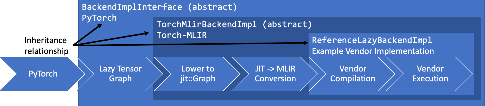
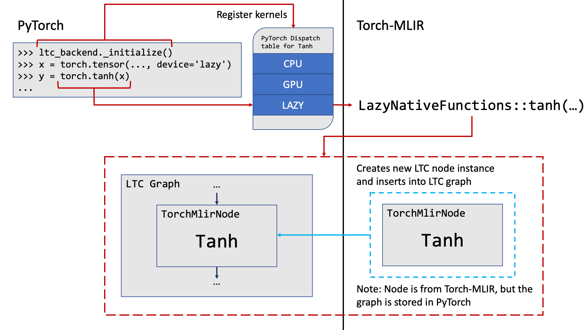
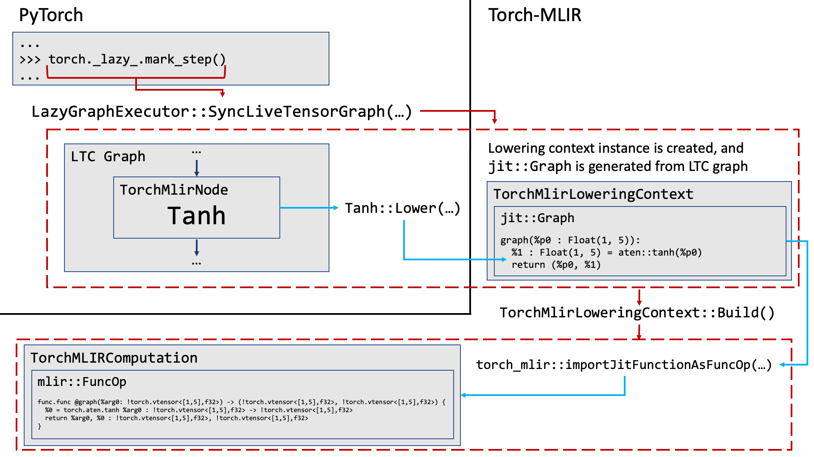
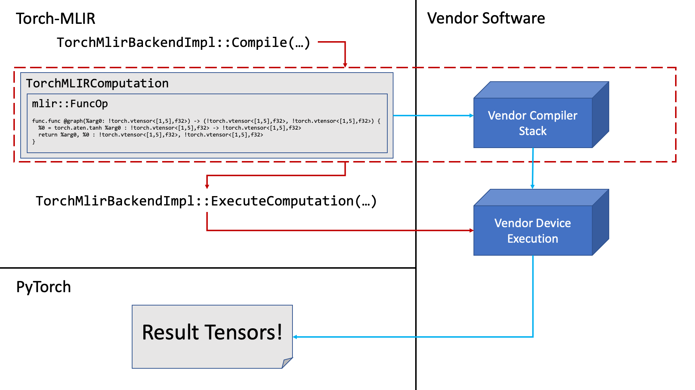

# Torch-MLIR Lazy Tensor Core Backend

## Table of Contents
- [Introduction](#introduction)
- [Examples](#examples)
- [Code Structure](#code-structure)
- [Architecture](#architecture)
- [Implementing a custom backend](#implementing-a-custom-backend)
- [Future Expansion](#future-expansion)

## Introduction
[Lazy Tensor Core](https://github.com/pytorch/pytorch/blob/master/torch/csrc/lazy/tutorial.md) is a tracing system in PyTorch which is supported as an entry point to Torch-MLIR.
After registering an LTC backend, all operations performed on lazy tensors are recorded and handed off to the backend implementation.

LTC support is provided through an abstract [`TorchMlirBackendImpl`](../projects/ltc/csrc/base_lazy_backend/backend_impl.h) class, which handles the conversion to MLIR.
Implementations based on this abstract class will be able to specify their own compile and execution workflows.
Additional details about how to implement a custom backend is available [below](#Implementing-a-custom-backend).

## Examples
View examples [here](ltc_examples.md).

## Code Structure

### Autogen Build Tools ([`build_tools`](../build_tools))

- `autogen_ltc_backend.{py,yaml}`
  - The [autogen files](#autogen-files) are generated by this script based on the list of supported ops, which includes all ops from [`GeneratedTorchOps.td`](https://github.com/llvm/torch-mlir/blob/main/include/torch-mlir/Dialect/Torch/IR/GeneratedTorchOps.td),
    excluding those explicitly blacklisted in the YAML file

### Autogen Files ([`projects/ltc/csrc/base_lazy_backend/generated`](../projects/ltc/csrc/base_lazy_backend/generated))
Generated files are created in this directory, which is ignored by version control.

- `LazyIr.h`
  - Definitions of `torch::lazy:TorchMlirNode` subclasses for each supported autogen op
- `LazyNativeFunctions.{cpp,h}`
  - Native function definitions for each supported op (handles `at::Tensor -> at::Tensor` data flow and creation of `torch::lazy:TorchMlirNode`)
- `LazyNonNativeIr.h`
  - Non-native `torch::lazy:TorchMlirNode` subclasses
- `RegisterLazy.cpp`
  - Registers PyTorch kernels under the `lazy` dispatch key for all supported ops, which map to our native functions
- `shape_inference.{cpp,h}`
  - Shape inference headers for supported ops and autogen'd placeholders for unimplemented functions

### Base Backend ([`projects/ltc/csrc/base_lazy_backend`](../projects/ltc/csrc/base_lazy_backend))

- `backend_impl.{cpp,h}`
  - Base LTC backend to setup Torch-MLIR lowering context
- `dynamic_ir.{cpp,h}`
  - Manually implemented "dynamic" nodes
- `ir_builder.h`
  - Torch-MLIR implementation of `torch::lazy::IrBuilder`
- `mlir_lowering_context.h`
  - Handles conversion from `torch::lazy::Node` to MLIR via JIT and Torch-MLIR infrastructure
- `mlir_native_functions.cpp`
  - Manually implemented native functions
- `mlir_node.{cpp,h}`
  - Torch-MLIR implementation of `torch::lazy::Node`
- `mlir_node_lowering.{cpp,h}`
  - Lower a `torch::lazy::Node` to JIT graph in preparation for MLIR generation
- `shape_inference.cpp`
  - Implementation of select shape inference functions (most functions are [implemented upstream](https://github.com/pytorch/pytorch/blob/master/torch/csrc/lazy/core/shape_inference.cpp))

### Reference Backend ([`python/torch_mlir/csrc/reference_lazy_backend`](../python/torch_mlir/csrc/reference_lazy_backend))

- `backend_impl.{cpp,h}`
  - Reference Torch-MLIR LTC backend implementation, which simply stores the MLIR as a string and executes computation on CPU
- `reference_lazy_backend_pybind.cpp`
  - pybind for reference Torch-MLIR LTC backend

### Examples ([`examples`](../examples))

- `ltc_backend_bert.py`
  - Example HuggingFace BERT model traced by LTC to MLIR
- `ltc_backend_mnist.py`
  - Example MNIST model traced by LTC to MLIR

## Architecture



### Tracing LTC graph

The journey begins with a tensor in PyTorch on the `lazy` device, which may undergo a number of operations during its lifetime.
```python
>>> lazy_backend._initialize()
>>> x = torch.tensor(..., device='lazy')
>>> y = torch.tanh(x)
...
```
The call to `torch.tanh` triggers a chain of events. PyTorch checks the dispatch table under the `lazy` key and finds the kernel for `tanh`
previously registered in `RegisterLazy.cpp`.

Next, `LazyNativeFunctions::tanh` from `LazyNativeFunctions.cpp` is called, which triggers the creation of a `Tanh` node, which is a subclass of `TorchMlirNode` and `torch::lazy::Node`, defined in `LazyIr.h`.
These nodes are then tracked internally by LTC as the computation graph is traced out.



### Syncing Tensors

At some point, the tensors will be synced in order to execute the computation -- either explicitly via `mark_step`, or implicitly through some operation that requires the contents of the tensors (e.g. printing to console).

```python
>>> torch._lazy.mark_step()
```

This triggers a call to `LazyGraphExecutor::SyncLiveTensorsGraph` somewhere in the guts of LTC, which collects all the `TorchMlirNode`s (technically `torch::lazy::Node`s at this point) from the current trace and
creates an instance of `TorchMlirLoweringContext`. Here, the `TorchMlirNode`s are lowered to JIT via `mlir_node_lowering.cpp` and inserted into a `jit::Graph`.

Next, `TorchMlirLoweringContext::Build` is executed and the final `jit::Graph` is sent to `torch_mlir::importJitFunctionAsFuncOp` to generate MLIR using the existing infrastructure from Torch-MLIR.
At this point, a `TorchMlirComputation` is created containing the final `mlir::FuncOp`.



### Final Compilation and Execution

The `TorchMlirComputation` is sent to the vendor specific implementation of `TorchMlirBackendImpl::Compile` to be handed off to the vendor's compilation stack (if applicable).

Finally, the compiled computation is sent to `TorchMlirBackendImpl::ExecuteComputation` to be executed on the vendor device, which produces some results to be send back to PyTorch.



## Implementing a custom backend

A reference implementation of a custom backend is available [here](../python/torch_mlir/csrc/reference_lazy_backend/).
All the work involved with generating MLIR is handled in the base LTC backend, so vendors only need to worry about implementing `Compile`, `ExecuteComputation`, and some other minor methods to interface with the device.

A pybind is needed to invoke C++ code to register the autogen PyTorch kernels and the custom backend itself.
Most of the code in the reference implementation should be reusable, excluding some debug related function (e.g. `get_latest_computation`).

## Future Expansion

There are a number of areas for future improvement:
- Generate source information in `jit::Graph` so it can be embedded in the MLIR
- Currently the reference backend implementation executes via the `jit::Graph` instead of the MLIR since we currently lack lowerings for many ops, which would make it difficult to run models such as HF BERT
  - In the future, we should change the implementation to lower the MLIR to linalg and execute on a reference backend
- As new models get tested, we will inevitably run into errors related to unimplemented shape inference functions.
This problem is simply solved by implementing the missing function, or adding a structured kernel to PyTorch.
